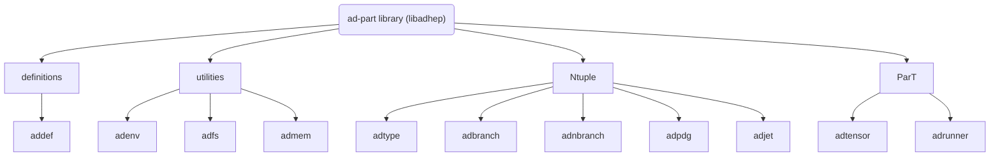
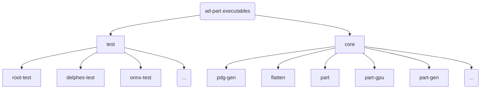
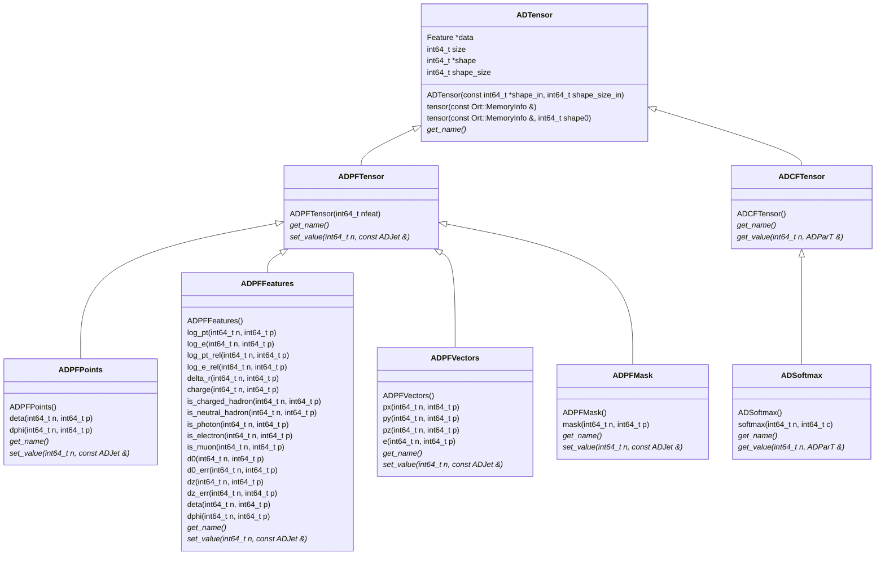

# ad-part: Anomaly detection aided by Particle Transformer

repo: https://github.com/lyazj/ad-part

architecture:





`adtensor` architecture:



design: split data preprocessing (flatten, normalize, etc.) and model running

* partially due to conveniences gained upon current third-party library interfaces
* enabling intermediate result checking, improving robustness and maintainability
* enabling a quick startup of the model, saving our time to tune or debug on it

`flatten`: from Delphes AT to flat Ntuple

main idea:

* In `ADJet` constructor, do RTTI for its constituents, routing to corresponding `ADParticle ` constructor
* Robustness: unrecognized objects are detected and warned

reference: https://github.com/delphes/delphes/blob/master/examples/Example3.C

```c++
ADJet(const ADPDGQuerier &, const Jet &);

ADParticle(const GenParticle &, const TLorentzVector &p4_jet, const ADPDGQuerier &);
ADParticle(const Track &, const TLorentzVector &p4_jet, const ADPDGQuerier &);
ADParticle(const Tower &, const TLorentzVector &p4_jet, const ADPDGQuerier &);
ADParticle(const Muon &, const TLorentzVector &p4_jet, const ADPDGQuerier &);
```

`part`/`part-gpu`: from flat Ntuple to ParT scores

main idea:

* ONNX model exporting: `ParT_full.pt` $\to$ `part.onnx`
* run the model on GPU powered by [ONNX Runtime](https://onnxruntime.ai/)
